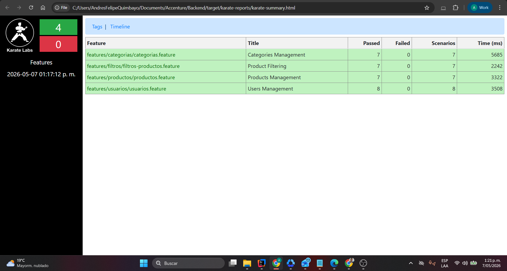

# Backend Test Framework - Accenture QA

Framework de automatización de pruebas backend
utilizando **Karate Framework**, **Gradle** y **Cucumber**
para validar servicios REST de la API pública de Petstore

## Descripción

Este framework automatiza las pruebas de servicios REST de la API de Petstore (https://petstore.swagger.io), validando los siguientes escenarios:

**1. Añadir una mascota a la tienda** (POST /pet)

**2. Consultar la mascota ingresada por ID** (GET /pet/{petId})

**3. Actualizar el nombre de la mascota y el estatus a vendido** (PUT /pet)

**4. Consultar la mascota modificada por estatus** (GET /pet/findByStatus)

Cada módulo incluye:

- Escenarios de prueba end-to-end
- Validación de status codes, headers y body
- Validación de estructura JSON mediante schemas
- Pruebas con datos válidos dinámicos
- Generación automática de IDs únicos

## Tecnologías

- **Karate Framework 1.4.1** - Framework de pruebas API
- **Java JDK 11** - Lenguaje de programación
- **Gradle** - Gestor de dependencias y construcción
- **JUnit 5** - Framework de ejecución de pruebas
- **Cucumber** - BDD y reportes

## Requisitos Previos

Antes de ejecutar el proyecto, asegúrate de tener instalado:

1. **Java JDK 11 o superior**

2. **Git** (para clonar el repositorio)

## Instalación

### 1. Clonar el repositorio

git clone <URL_DEL_REPOSITORIO>

cd backend-test-framework

### 2. Descargar dependencias

gradlew clean build -x test

./gradlew clean build -x test

## Ejecución de Pruebas

### Ejecutar TODAS las pruebas de Petstore (4 escenarios)

gradlew test

### Ejecutar pruebas individuales

gradlew test --tests CrearMascotaRunner
gradlew test --tests ConsultarMascotaIdRunner
gradlew test --tests ActualizarMascotaRunner
gradlew test --tests ConsultarMascotaStatusRunner

## Generación de Reportes

### Ejecutar pruebas y en la consola se visualizara el enlace del reporte de Karate

### Ubicación de los reportes

Después de la ejecución, los reportes se generan en:

**Reporte de Karate**

target/karate-reports/karate-summary.html

## Reporte del Proyecto

## Autor

**Andres Quimbayo - Accenture**